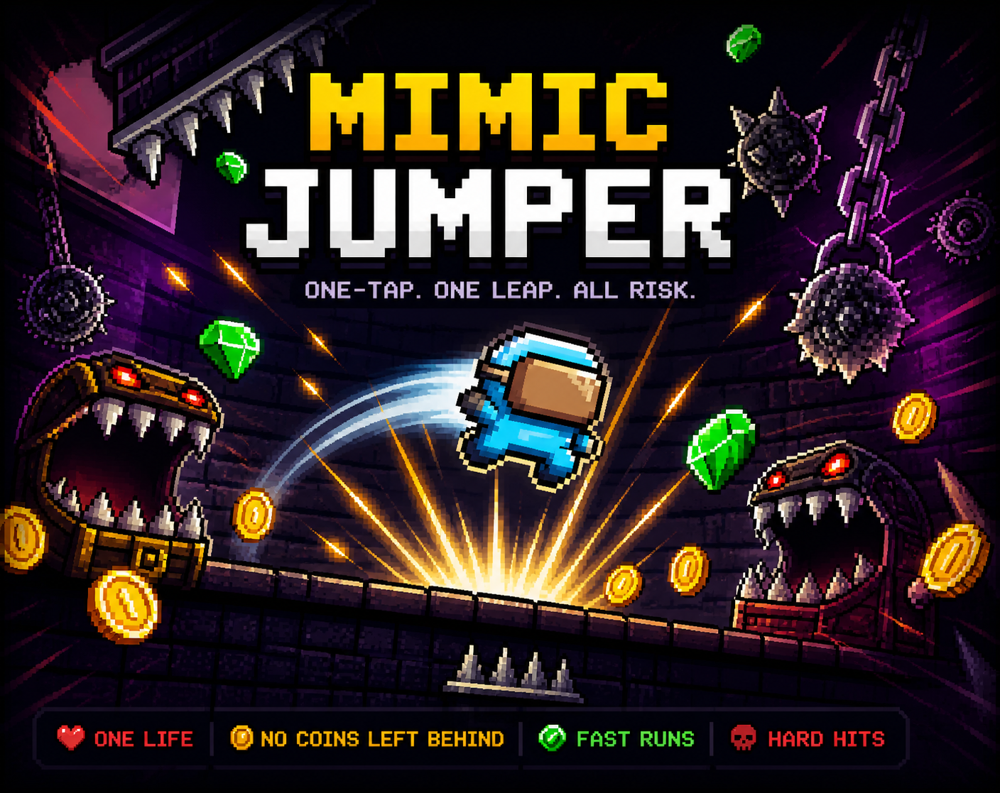
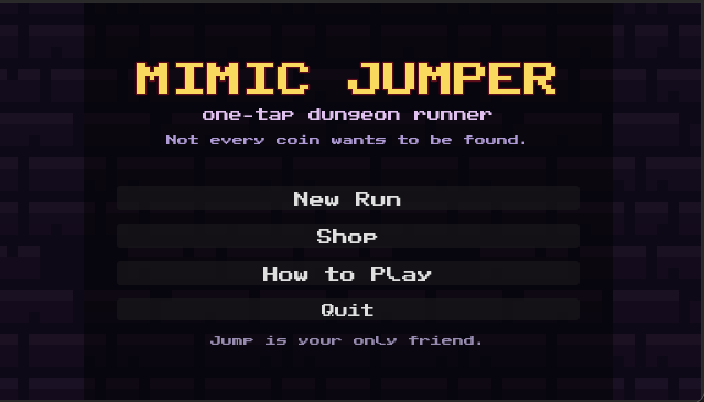
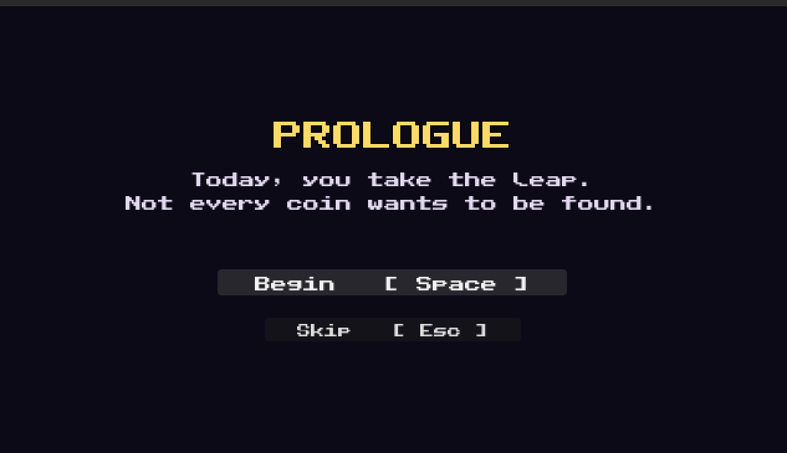
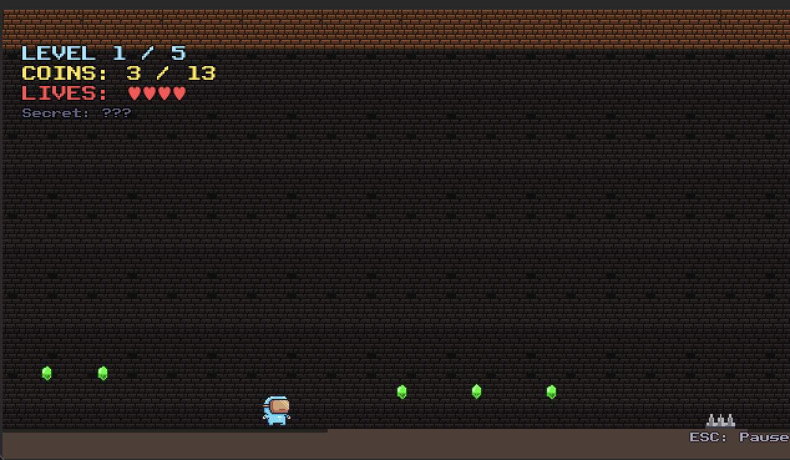
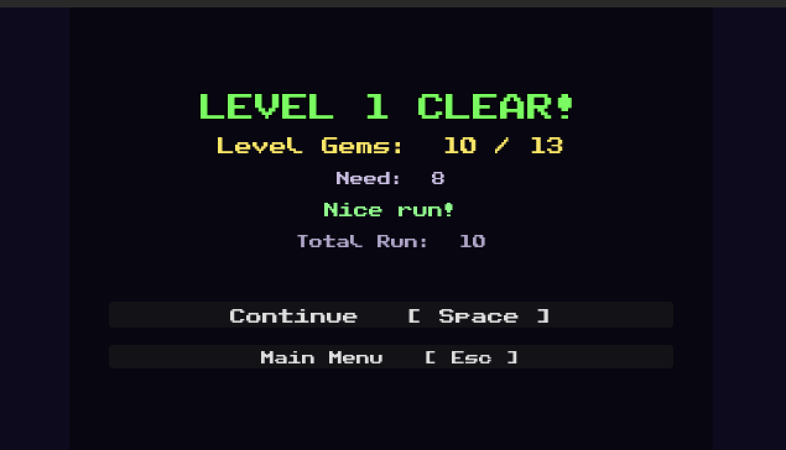
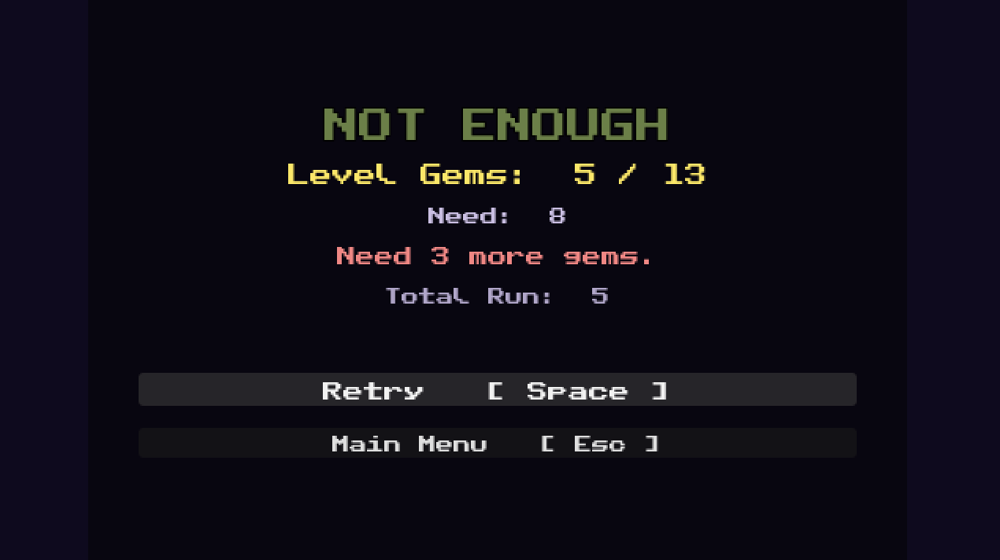
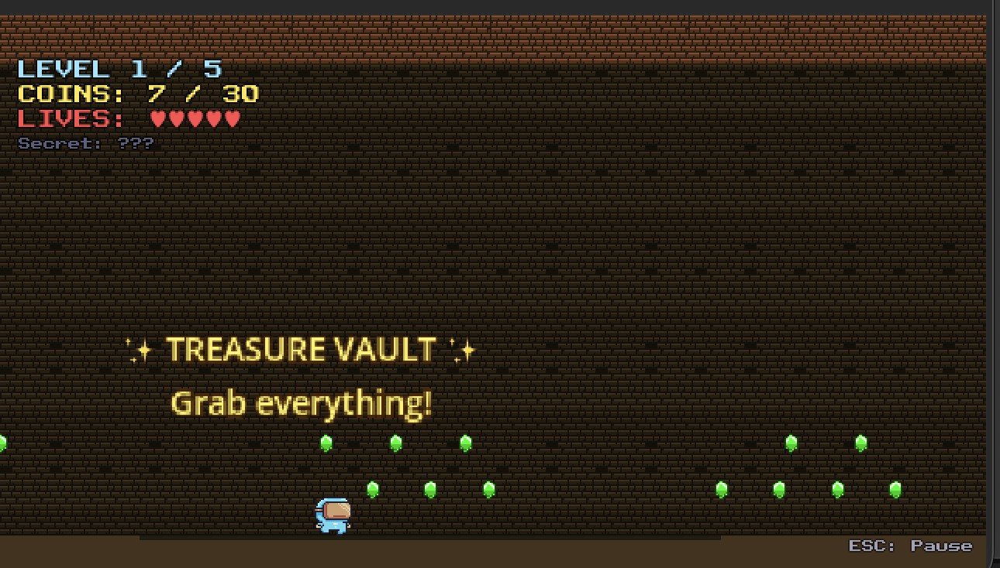

# 🏰 MIMIC!

> **A one-button dungeon runner where not every coin wants to be found.**

<p align="center">
  
</p>

Sebuah platformer rapid-prototyping yang dibangun dalam satu bulan untuk **Solo Game Project CSCE604021 Game Development — Fakultas Ilmu Komputer Universitas Indonesia**. Game jam submission: **Individual Game Jam CSUI 2026** di itch.io.

---

## 🖼️ Screenshots

<p align="center">
  
  
</p>
<p align="center">
  
  
</p>
<p align="center">
  
  
</p>

---

## 📖 Daftar Isi

1. [Konsep & Tema](#-konsep--tema)
2. [Diversifier yang Dipilih](#-diversifier-yang-dipilih)
3. [Fitur Wajib — Mapping](#-fitur-wajib--mapping)
4. [Cara Main](#-cara-main)
5. [Karakter & Kemampuan](#-karakter--kemampuan)
6. [Level Structure](#-level-structure)
7. [Mekanik Inti](#-mekanik-inti)
8. [Arsitektur Teknis](#-arsitektur-teknis)
9. [Cara Install & Run](#-cara-install--run)
10. [Project Structure](#-project-structure)
11. [Kredit Aset](#-kredit-aset)
12. [Catatan Developer](#-catatan-developer)

---

## 🎯 Konsep & Tema

### Premis

Anda adalah seorang **treasure hunter** yang memasuki dungeon kuno. Koin emas berserakan di mana-mana — tapi dungeon ini menipu: **sebagian koin sebenarnya adalah mimic**, monster yang menyamar. Sekali mereka sadar Anda dekat, kulit emas mereka mengelupas dan taring mereka muncul.

Anda hanya membawa satu senjata: **kemampuan melompat**. Tidak ada pedang, tidak ada perisai. Hanya mata yang tajam dan refleks yang cepat.

### Premis Design

- **One button** → batasan ekstrem yang memaksa desain kreatif
- **Visual deception** → mimic coin identik dengan koin asli sampai menit terakhir
- **Hidden rewards** → aksi "bodoh" (sengaja jatuh ke pit) adalah kunci rahasia
- **Run-based progression** → 5 level berjenjang dengan 1 bonus level tersembunyi

### Mood & Tone

Dungeon tua, ungu-kegelapan, dengan kilauan emas yang menggoda. Terinspirasi oleh tema *Dark Souls* minimalist, *Geometry Dash* rhythm platforming, dan humor paranoid *Don't Trust Your Eyes*.

---

## 🎲 Diversifier yang Dipilih

Tugas ini mewajibkan kombinasi **3 diversifier unik**. Berikut pilihan saya dan implementasinya:

### 🔘 **D24** — `A.` (VTuber Culture / One-Button Controller)

> *"Implementasi game hanya dengan satu tombol controller."*

**Implementasi:**
- Satu-satunya action di Input Map: `jump` (Space + Mouse Left Click)
- Player **auto-run** ke kanan dengan kecepatan konstan 130 px/s — pemain tidak bisa berhenti atau mundur
- Mekanik jump lengkap: **variable jump height** (release early = lompat pendek), **coyote time** (0.1s grace saat lari dari tepi), **jump buffer** (0.1s grace kalau tekan sebelum mendarat)
- Bahkan UI semua navigable dengan Space: Enter Dungeon, Continue di intermission, Play Again di Win/GameOver — satu tombol
- Quit button bisa di-klik mouse tapi tidak mengganggu flow keyboard-first

**Filosofi:** Pembatasan radikal memaksa setiap level menjadi **timing-puzzle**, bukan spatial puzzle. Setiap situasi ditanya: *"kapan melompat?"* — bukan *"ke mana pergi?"*

### 🎭 **D46** — `Credens Justitiam` (Madoka Magica / Look-alike Differences)

> *"Musuh/Objek yang kelihatan sama memiliki perbedaan tidak terduga."*

**Implementasi:**
- **MimicCoin** vs **Coin biasa** — sprite identik secara visual di jarak jauh
- Differentiator: **subtle shake** (0.4px random amplitude, hampir tidak terlihat) — petunjuk bagi pemain yang observatif
- Saat player masuk **DetectionArea** (radius 35px) di sekitar MimicCoin:
  1. Flash merah (`modulate = Color(1.5, 0.5, 0.5)`)
  2. Timer 0.12 detik
  3. Transform ke **revealed form** — monster bertaring dengan texture yang berbeda
- **Consequence mismatch:**
  - Touching IDLE/WARNING state mimic = **+1 coin** (reward for fast reaction)
  - Touching REVEALED state mimic = **-1 life**
- Dengan player speed 130 px/s + detection radius 35px, player sampai ke mimic dalam ~0.27s — **lebih lambat dari transform 0.12s**. Artinya: auto-runner harus **melompat** untuk menghindari, bukan meng-grab cepat.

**Filosofi:** Objek yang terlihat identik memaksa pemain selalu **waspada**. Setiap koin adalah pertanyaan: *"grab atau jump?"*

### 🗝️ **D29** — `Trash Enjoyer` (Hoyoverse Culture / Secret via Repetition)

> *"Melakukan hal tidak berfaedah berulang kali akan memicu sebuah rahasia dalam permainan."*

**Implementasi:**
- Di setiap level 2-5, ada **pit** (lubang di main floor) yang *secara normal* akan membunuh player
- Di dasar pit ada **SecretTrigger** (Area2D di y=260)
- Jatuh ke pit **TIDAK mengurangi nyawa** — life refunded oleh `Global.trigger_secret_fall()`. Pit jadi "free exploration zone"
- Counter `secret_fall_count` bertambah setiap jatuh:
  - Fall #1: HUD "SECRET: 1/3"
  - Fall #2: "SECRET: 2/3"
  - Fall #3: "SECRET: UNLOCKED ✨"
- Saat `secret_unlocked = true`, pada respawn berikutnya **SecretWall hancur** (`queue_free()`)
- Dengan wall hancur, player bisa jalan di main floor melewati area wall → hit **SecretDoor** → teleport ke **BonusLevel** (30 coin gratis, no hazard)

**Filosofi:** Pemain "kasual" melewati level tanpa curiga. Pemain yang **penasaran** sama lubang aneh akan mencoba jatuh → discover mekanik sendiri. "Hal bodoh" jadi jalur premium.

---

## ✅ Fitur Wajib — Mapping

Tugas menyaratkan 7 fitur wajib. Berikut lokasinya:

| # | Fitur Wajib | Implementasi |
|---|-------------|--------------|
| 1 | **Min 1 GDScript dengan fungsionalitas** | 15 script (.gd) di `scripts/` |
| 2 | **UI state info** | `HUD.tscn` — Level X/5, Coins cumulative, Lives (♥), Secret progress |
| 3 | **Menu awal (start/quit)** | `MainMenu.tscn` — "Enter Dungeon" + "Quit" |
| 4 | **End condition (win/lose)** | `WinScreen.tscn` (5 levels clear), `GameOverScreen.tscn` (0 lives) |
| 5 | **Min 1 level playable** | 5 level utama + 1 bonus level |
| 6 | **Min 1 challenge** | Setiap level: MimicCoin recognition, jump timing, pit management |
| 7 | **Min 1 objek player-controlled** | `Player.tscn` — CharacterBody2D dengan jump mechanic |

---

## 🎮 Cara Main

### Kontrol

| Action | Input |
|--------|-------|
| **Jump** | `Space` atau `Mouse Left Click` |
| **Navigate Menu** | `Space` (start/continue) atau klik button |
| **Quit** | Klik tombol Quit di MainMenu |

### Goal

Tembus 5 level dungeon → reach layar **"DUNGEON CONQUERED!"**. Kumpulkan emas sebanyak mungkin sepanjang jalan.

### 3 Jenis Interaksi Utama

**1. Coin (aman)** 💰
- Sentuh = **+1 gold**, increment level counter dan total
- Tidak ada risk

**2. MimicCoin (bahaya)** 👹
- **Visual identik** dengan coin biasa, bergetar halus
- Dekat = flash merah 0.12s → transform jadi **monster**
- Sentuh monster = **-1 life**
- Strategi: **lompat** saat lihat red flash, JANGAN grab

**3. Pit (secret)** 🗝️
- Visual: lubang di main floor, sign bertuliskan "↓ FALL 3x = SECRET ↓"
- Jatuh = **tidak rugi nyawa** (refunded)
- Jatuh 3x = **SecretWall hancur** permanen untuk run ini
- Setelah wall hancur → akses **SecretDoor** di main floor past wall → **BonusLevel**

### Nyawa & Game Over

- **5 nyawa total** (shared across all 5 levels, tidak reset per level)
- Habis semua nyawa → GameOver → ulang dari Level 1

### Threshold System

Tidak semua coin harus diambil, tapi ada **minimum** untuk lanjut level. Kalau tidak tercapai, IntermissionScreen memaksa retry.

| Level | Total Coin Available | Threshold Minimum |
|-------|---------------------|-------------------|
| 1 | 12 | **5** (~42%) |
| 2 | 19 | **8** (~42%) |
| 3 | 19 | **9** (~47%) |
| 4 | 24 | **10** (~42%) |
| 5 | 27 | **12** (~45%) |

---

## 🦸 Karakter & Kemampuan

Skin di Shop bukan cuma kosmetik. Tiap karakter punya satu kemampuan khusus, jadi pilihan skin ngaruh ke cara main. Mask Dude gratis dan jadi baseline, tiga sisanya dibeli pakai gems dan masing-masing kasih satu perk.

| Karakter | Harga | Kemampuan |
|----------|-------|-----------|
| **Mask Dude** | Gratis | Seimbang, tanpa perk khusus |
| **Pink Man** | 30 gems | Lebih tahan, mulai dengan +1 nyawa (maksimal 6) |
| **Ninja Frog** | 60 gems | Pemburu rahasia, secret path kebuka cukup 1 kali jatuh (bukan 3) |
| **Virtual Guy** | 100 gems | Mata peretas, mimic ketahuan dari jarak 2x lebih jauh |

Deskripsi kemampuan ini juga ditampilkan langsung di kartu Shop biar gampang dibandingin sebelum beli.

---

## 🏗️ Level Structure

### Progression Flow

```
MainMenu
   │
   ▼
Level 1 ─► Intermission ─► Level 2 ─► Intermission ─► Level 3 ─► ...
   (tutorial)                   │
                                ├─► (D29 path)
                                │         │
                                │         ▼
                                │    BonusLevel (1x per run)
                                │         │
                                │         ▼
                                │     Level 3 (continue)
                                ▼
                              Level 3 → Level 4 → Level 5 → WinScreen
                                                              │
                                                         (or GameOver)
```

### Level Breakdown

| Level | Tema | Length | Geometry | Mimics | Spikes | D29? |
|-------|------|--------|----------|--------|--------|------|
| **1** | Entrance (Tutorial) | ~1200px | Flat floor | 1 | 2 | ❌ |
| **2** | First Fall | ~1700px | Flat + pit + upper platform | 2 | 2 | ✅ |
| **3** | The Climb | ~2100px | Multi-height platforms (3 tier) | 3 | 3 | ✅ |
| **4** | Gauntlet | ~2200px | Geometry Dash style rapid jumps | 5 | 4 | ✅ |
| **5** | Mimic's Lair | ~2300px | Dense multi-height, darkest hue | 7 | 5 | ✅ |
| **Bonus** | Treasure Vault | ~1000px | Flat, zero hazard | 0 | 0 | — |

### Dual-Path Design (Level 2-5)

Inspired by "Masha and the Bear balloon" — player memiliki kebebasan vertikal:

```
                   Upper platform (y=60, safe)
       ═══════════════════════════════════════
                      ┌──────┐                 FinishDoor → Next Level
                      │ WALL │                    (on upper)
                      │ 48px │
   ──Coin──Coin──────┤      ├──[SecretDoor]──── Main floor (y=120)
                     └──────┘    (→ Bonus)
            ↑                    ↑
       Pit (D29)             Only active
                          after D29 unlocked
```

**3 cara selesai Level 2-5:**
1. **Upper path** (safe) — Jump ke upper platform, walk atas wall, reach upper FinishDoor → next level
2. **Main floor skill jump** — Time a tight jump to clear wall (11px window) → past wall... tapi tanpa D29, SecretDoor di-disable, player fall off main floor end
3. **D29 path** — Fall in pit 3x → wall destroyed → walk main floor → SecretDoor → BonusLevel

---

## ⚙️ Mekanik Inti

### Player Physics

```gdscript
@export var run_speed: float = 130.0          # auto-run speed
@export var jump_velocity: float = -330.0     # initial upward velocity
@export var gravity: float = 900.0            # downward acceleration
@export var max_fall_speed: float = 500.0     # terminal velocity
@export var coyote_time: float = 0.1          # jump after leaving edge
@export var jump_buffer_time: float = 0.1     # jump before landing
```

**Derived values:**
- Max jump height: ~60.5px (`jump_velocity²/2g`)
- Peak jump time: 0.367s
- Horizontal distance at peak: ~47.7px
- Full jump air time: ~0.733s
- Horizontal distance full jump: ~95.3px

### Variable Jump Height

```gdscript
if Input.is_action_just_released("jump") and velocity.y < 0:
    velocity.y *= 0.5  # cut short if released early
```

Pemain yang tap cepat → lompat rendah. Pemain yang hold → lompat full. Ini fundamental untuk D24 — satu tombol, tapi **dua** style lompat.

### Wall Clearability (Level 2-5)

Dengan wall height 48px (y=72 sampai y=120):
- Peak feet y = 59.5 (< wall top 72) → secara teori bisa di-jump over
- Time window feet<72: 0.333s
- Horizontal distance clearable: 43.3px
- Wall width: 32px
- **Jump x window untuk clear wall: ~11px (85ms timing)**

Extremely tight — ini **intentional skill challenge**. Pemain yang tidak bisa timing punya 2 alternatif (upper path / D29).

### MimicCoin State Machine

```
IDLE (shake) ─── player within 35px ──► WARNING (red flash) ─── 0.12s ──► REVEALED (monster)
                                             │                                 │
                                             ▼                                 ▼
                                      grab = +1 coin                    touch = -1 life
```

### D29 Secret Counter

Persistent per-level, reset saat enter level baru:

```gdscript
# Global.gd
var secret_fall_count: int = 0
var secret_unlocked: bool = false

func trigger_secret_fall() -> void:
    secret_fall_count += 1
    lives += 1  # refund — pit falls are free
    if secret_fall_count >= 3:
        secret_unlocked = true
```

Level.gd handles wall destruction on respawn:

```gdscript
func _on_player_died(_reason: String) -> void:
    if Global.is_game_over():
        get_tree().change_scene_to_file.call_deferred(GAME_OVER_PATH)
    else:
        player.global_position = player_start_position
        player.velocity = Vector2.ZERO
        if Global.secret_unlocked and has_node("SecretWall"):
            $SecretWall.queue_free()
```

### BonusLevel One-Time Gate

```gdscript
var bonus_visited_this_run: bool = false

# SecretDoor.gd
func _on_body_entered(body):
    if body.is_in_group("player") and Global.secret_unlocked and not Global.bonus_visited_this_run:
        get_tree().change_scene_to_file.call_deferred(Global.enter_bonus_level())
```

Sekali visit dalam 1 run, SecretDoor di-disable di level berikutnya meskipun D29 selesai. Player harus strategic: D29 di level mana worth it? (Level 2 easier pit, Level 5 lebih challenging tapi near end-game.)

### Intermission Threshold

```gdscript
# Global.gd
var level_thresholds: Dictionary = {
    1: 5, 2: 8, 3: 9, 4: 10, 5: 12,
}

func meets_threshold() -> bool:
    var threshold = level_thresholds.get(intermission_level_num, 0)
    return intermission_coins_collected >= threshold
```

Jika gagal threshold → "NOT ENOUGH GOLD" → Retry. Coins dari attempt gagal di-refund supaya tidak double-count.

---

## 🏛️ Arsitektur Teknis

### Engine & Version

- **Godot 4.6** (compatible dengan Godot 4.2+)
- GDScript only — no C# / C++
- 2D rendering dengan viewport **640x360** (pixel art native resolution)
- Target platform: Windows desktop build (.exe)

### Scene Tree Overview

```
Level (Node2D)
├── SkyLayer (CanvasLayer, layer=-10)          — solid backdrop always visible
│   └── SkyRect (ColorRect)
├── ParallaxBackground                          — decorative bg layer
│   └── ParallaxLayer
│       └── BgSprite
├── Floors (Node2D)                             — all StaticBody2D floors/platforms
│   ├── MainFloor / Floor1 / Floor2 / ...
│   ├── UpperPlatform / UpperSecret
│   └── LeftWall (prevents walking off-screen left)
├── Pickups (Node2D)                            — Coins + MimicCoins, counted for threshold
│   ├── Coin1..N
│   ├── MimicCoin1..N
│   └── BonusCoin1..N (on upper platform)
├── Spikes (Node2D)
├── Signs (Node2D)                              — Label hints (Level 2-5)
│   ├── SignPit ("↓ FALL 3x = SECRET ↓")
│   └── SignBonus ("→ BONUS →")
├── SecretTrigger (Area2D)                      — D29 pit-bottom detector
├── SecretWall (StaticBody2D)                   — blocks main floor until D29
├── Player (CharacterBody2D, group: "player")
│   ├── Sprite2D / AnimatedSprite2D
│   ├── CollisionShape2D (14x22)
│   └── Camera2D (zoom: 2x)
├── FinishDoor (Area2D, on upper platform)      — → IntermissionScreen → next level
├── SecretDoor (Area2D, on main floor past wall) — → BonusLevel (gated)
└── HUD (CanvasLayer instance)
```

### Script Responsibilities

| Script | Responsibility |
|--------|---------------|
| `Global.gd` (autoload) | Persistent state: current_level, coins, lives, D29 counter, bonus flag, thresholds, scene routing |
| `Player.gd` | Auto-run, jump mechanics, coyote/buffer timing, die() emit signal |
| `Level.gd` | Respawn handling, pickup counting, route to IntermissionScreen/GameOver on events |
| `Coin.gd` | +1 level & total coin on pickup |
| `MimicCoin.gd` | State machine (IDLE → WARNING → REVEALED), shake animation, reward/damage logic |
| `Spike.gd` | -1 life on contact, call player.die() |
| `SecretTrigger.gd` | D29 counter increment, refund life, trigger respawn |
| `SecretWall.gd` | Static obstacle — removed via `queue_free()` from Level.gd |
| `FinishDoor.gd` | Emit `reached` signal on player contact |
| `SecretDoor.gd` | Double-gated (secret_unlocked AND not bonus_visited), deferred scene change to BonusLevel |
| `BonusFinishDoor.gd` | Exit BonusLevel → next regular level |
| `HUD.gd` | Live-update level number, coins, lives, secret progress |
| `MainMenu.gd` | Start new game (reset Global state) / Quit |
| `IntermissionScreen.gd` | Threshold check, Continue or Retry |
| `WinScreen.gd` | Show final stats, Play Again or Main Menu |
| `GameOverScreen.gd` | Show how far player got, Play Again or Main Menu |

### Key Design Decisions

**1. Scene changes via string paths (not PackedScene exports)**
```gdscript
get_tree().change_scene_to_file.call_deferred("res://scenes/Level2.tscn")
```
Alasan: PackedScene cross-references menyebabkan circular dependency saat compile. String paths resolved at runtime — lebih safe untuk rapid prototyping.

**2. `call_deferred` for all physics-triggered scene changes**
Signal `body_entered` fires dari physics engine. Scene change yang synchronous di dalamnya akan error: *"Removing a CollisionObject during physics callback is not allowed."* Solusi: defer scene change ke frame berikutnya.

**3. `_unhandled_input` instead of `_process` for keyboard shortcuts**
`Input.is_action_just_pressed("jump")` triggers untuk Space AND mouse click. Kalau pakai `_process`, klik Quit button juga fire start action → race condition. `_unhandled_input` hanya fire kalau GUI tidak consume event — mouse klik button = consumed, tidak propagate.

**4. Autoload Global for state persistence**
Scene changes reset semua local state. Global autoload survive across scenes. Semua persistent state (lives, coins, progress) stored di Global.

**5. Group-based player detection**
`body.is_in_group("player")` instead of type checking. Memungkinkan future refactor (e.g., multi-player) tanpa ubah hazard logic.

---

## 🚀 Cara Install & Run

### Prasyarat

1. **Godot 4.6** (or 4.2+) — download dari https://godotengine.org/download

### Import Project

1. Extract ZIP file
2. Open Godot → **Import**
3. Pilih `project.godot` di folder hasil extract
4. Click Import → tunggu sampai Godot selesai import aset

### Run in Editor

Tekan **F5** → Main Menu muncul → Space / click Enter Dungeon → mulai main.

### Build Standalone (.exe)

1. Godot → **Project → Export**
2. Add preset: **Windows Desktop**
3. Template: download kalau belum ada (tombol Manage Export Templates)
4. **Export Project** → simpan `.exe` + data pack

### Troubleshooting

**"Load failed..." saat first open:**
- Close Godot
- Buka lagi, import ulang — seharusnya clean setelah second load

**Error di FileSystem panel:**
- **Project → Reload Current Project**

**Quit button tidak menutup game di Editor:**
- Expected behavior. `get_tree().quit()` hanya close di build (.exe), bukan di Editor play mode. Build export untuk test proper quit.

---

## 📁 Project Structure

```
Mimic/
├── project.godot                 # Godot config, autoload, input map
├── icon.svg                      # App icon
├── README.md                     # This file
│
├── assets/
│   ├── sprites/                  # Production sprites (Pixel Adventure + 0x72 + LaRed)
│   │   ├── player/               # idle/run/jump/fall/hit + variants (Pixel Frog CC0)
│   │   ├── coin.png, coin_spin.png
│   │   ├── mimic_revealed.png, mimic_chest_revealed.png, chest.png
│   │   ├── spike.png, finish_door.png
│   │   ├── tile_floor.png, tile_wall.png, terrain_atlas.png
│   │   ├── secret_wall.png, dungeon_ceiling.png
│   │   ├── parallax_bg.png, bg_vignette.png, lava_strip.png
│   │
│   ├── audio/
│   │   ├── sfx/                  # jump.ogg, coin_pickup.ogg, player_hit.ogg, mimic_reveal.wav
│   │   └── bgm/                  # intro / dungeon_loop / intermission / outro (.mp3)
│   │
│   ├── fonts/                    # PublicPixel.ttf (GGBot CC0)
│   │
│   ├── _raw_downloads/           # original asset zips/files (audit trail, not shipped)
│   └── _extracted/               # unzipped source packs (audit trail, not shipped)
│
├── scenes/                       # 18 Godot scenes
│   ├── MainMenu.tscn
│   ├── Level1.tscn               # ~1200px, tutorial
│   ├── Level2.tscn               # ~1700px, pit intro
│   ├── Level3.tscn               # ~2100px, multi-height
│   ├── Level4.tscn               # ~2200px, gauntlet
│   ├── Level5.tscn               # ~2300px, finale
│   ├── BonusLevel.tscn           # ~1000px, 30 coins
│   ├── IntermissionScreen.tscn   # between-level summary
│   ├── WinScreen.tscn
│   ├── GameOverScreen.tscn
│   ├── Player.tscn               # with Camera2D
│   ├── Coin.tscn
│   ├── MimicCoin.tscn
│   ├── Spike.tscn
│   ├── FinishDoor.tscn
│   ├── SecretDoor.tscn           # gated on secret_unlocked
│   ├── SecretTrigger.tscn        # D29 counter
│   ├── SecretWall.tscn           # destructible
│   └── HUD.tscn                  # instanced in every Level
│
└── scripts/                      # 15 GDScript files
    ├── Global.gd                 # autoload
    ├── Player.gd
    ├── Level.gd
    ├── Coin.gd
    ├── MimicCoin.gd
    ├── Spike.gd
    ├── SecretTrigger.gd
    ├── SecretWall.gd
    ├── FinishDoor.gd
    ├── SecretDoor.gd
    ├── BonusFinishDoor.gd
    ├── HUD.gd
    ├── MainMenu.gd
    ├── IntermissionScreen.gd
    ├── WinScreen.gd
    └── GameOverScreen.gd
```

---

## 🎨 Kredit Aset

Semua aset eksternal yang dipakai di game ini terdaftar di bawah, lengkap dengan sumber dan lisensinya. Mayoritas adalah CC0 (public domain) atau CC-BY (atribusi). Aset disimpan di `assets/` (production) dan `assets/_raw_downloads/` + `assets/_extracted/` (sumber asli untuk audit).

### Engine

- **[Godot Engine 4.6](https://godotengine.org/)** — MIT License

### Sprites & Visual

| Aset | Sumber | Penulis | Lisensi |
|------|--------|---------|---------|
| Player (idle / run / jump / fall / hit) — Mask Dude, Ninja Frog, Pink Man, Virtual Guy | [Pixel Adventure 1](https://pixelfrog-assets.itch.io/pixel-adventure-1) | Pixel Frog | CC0 |
| Coins (`coin.png`, `coin_spin.png`) | [Coin & Gems Pack](https://laredgames.itch.io/gems-coins-free) | LaRed Games | CC0 |
| Dungeon tileset (`tile_floor.png`, `tile_wall.png`, `terrain_atlas.png`, `secret_wall.png`, `dungeon_ceiling.png`, `chest.png`, `mimic_chest_revealed.png`) | [0x72 Dungeon Tileset II v1.7](https://0x72.itch.io/dungeontileset-ii) | 0x72 | CC-BY 4.0 |
| Spikes, finish door, parallax bg, lava strip, vignette | Custom + komposit dari Pixel Adventure 1 + 0x72 Dungeon Tileset II | — | CC0 / CC-BY 4.0 (turunan) |
| Mimic revealed sprite (`mimic_revealed.png`) | Komposit custom berbasis 0x72 chest sprite | — | CC-BY 4.0 (turunan dari 0x72) |

### Audio — SFX

| File | Sumber | Penulis | Lisensi |
|------|--------|---------|---------|
| `jump.ogg` | [Kenney Interface Sounds](https://kenney.nl/assets/interface-sounds) | Kenney | CC0 |
| `coin_pickup.ogg` | [Kenney Interface Sounds](https://kenney.nl/assets/interface-sounds) | Kenney | CC0 |
| `player_hit.ogg` | [Kenney Impact Sounds](https://kenney.nl/assets/impact-sounds) | Kenney | CC0 |
| `mimic_reveal.wav` | [Freesound #262431 — "Monster Growl 1"](https://freesound.org/s/262431/) | jackieaz | CC0 |

### Audio — BGM

| File | Sumber | Penulis | Lisensi |
|------|--------|---------|---------|
| `dungeon_loop.mp3`, `intro.mp3`, `intermission.mp3`, `outro.mp3` | [Pixabay — "Exploration Chiptune RPG Adventure Theme" #336428](https://pixabay.com/music/main-title-exploration-chiptune-rpg-adventure-theme-336428/) | nickpanekaiassets | Pixabay Content License (free for commercial use, no attribution required — diberi credit di sini sebagai courtesy) |

### Font

| File | Sumber | Penulis | Lisensi |
|------|--------|---------|---------|
| `PublicPixel.ttf` | [Public Pixel Font](https://www.ggbot.net/fonts/) | GGBot (Ggbotnet) | CC0 |

### Code & Design

- Game design, level design, GDScript code, scene composition, dan integrasi aset: **Muhammad Kemal GP** — solo developer.

### Attribution-ready Block (siap copy-paste ke halaman itch.io)

```
## Credits

Engine
- Godot Engine 4.6 (MIT)

Art
- Pixel Adventure 1 — Pixel Frog (CC0) — player character (Mask Dude, Ninja Frog, Pink Man, Virtual Guy)
- Coin & Gems Pack — LaRed Games (CC0) — coin sprites
- 0x72 Dungeon Tileset II v1.7 — 0x72 (CC-BY 4.0) — dungeon tiles, chest, mimic base sprite

Audio
- Kenney Interface Sounds — Kenney (CC0) — jump SFX, coin pickup SFX
- Kenney Impact Sounds — Kenney (CC0) — player hit SFX
- "Monster Growl 1" Freesound #262431 — jackieaz (CC0) — mimic reveal SFX
- "Exploration Chiptune RPG Adventure Theme" Pixabay #336428 — nickpanekaiassets — BGM (intro, dungeon loop, intermission, outro)

Font
- Public Pixel — GGBot (CC0)

Code, level design, integration
- Muhammad Kemal GP — solo developer
```

---

## 🛠️ Catatan Developer

### Hard Constraints

- **Timeline:** 1 bulan (terpotong libur puasa)
- **Solo development:** dari asset ke kode ke level design semuanya 1 orang
- **Clean code tidak diprioritaskan** (instruksi tugas) — fokus ke rapid prototyping

### Compromises Made

1. **No tilemap** — main floor pakai StaticBody2D + scaled Sprite2D, cukup untuk MVP tapi tidak secanggih TileMap proper
2. **UI minimal** — pakai PublicPixel font, no transitions, no particles; cukup menyampaikan info tapi bisa lebih polished
3. **Player sprite** — pakai Pixel Adventure 1 Mask Dude tanpa custom rig; cukup untuk vibe dungeon-runner generik

### Potential Improvements (Post-Submission)

- [ ] Coin spin animation (`coin_spin.png` sudah ada, belum di-wire ke AnimatedSprite2D)
- [ ] Particle effect on coin pickup + mimic transform
- [ ] Screen shake pada mimic reveal
- [ ] Tileset-based level building (gantikan StaticBody2D + Sprite2D approach)
- [ ] Parallax bg with multiple layers (near/far)
- [ ] More levels + difficulty settings
- [ ] Leaderboard integration (itch.io LeaderBoard)

### Known Issues

- **None di branch main.** Semua bug yang teridentifikasi selama development sudah di-fix:
  - ~~SecretWall blocking main floor~~ → Fixed (wall now sits on floor, jumpable)
  - ~~MainMenu button path bug~~ → Fixed (paths updated for nested containers)
  - ~~Infinite fall~~ → Fixed (die threshold y>500)
  - ~~SecretDoor free access~~ → Fixed (gated on secret_unlocked + bonus_visited)
  - ~~Mouse click trigger wrong button~~ → Fixed (switched to `_unhandled_input`)
  - ~~CollisionObject removal during physics callback~~ → Fixed (`call_deferred`)

### Testing Matrix

| Scenario | Expected | Tested |
|----------|----------|--------|
| Main Level 1 → finish → Intermission shows 5/12 threshold → Continue → Level 2 | ✓ | ✅ |
| Fail threshold (grab 2 coins, finish) → Retry screen | ✓ | ✅ |
| Level 2 D29 (fall pit 3x) → wall destroyed → SecretDoor → Bonus | ✓ | ✅ |
| Level 2 skip D29 → Upper FinishDoor → Level 3 | ✓ | ✅ |
| Lose all 5 lives across multiple levels → GameOverScreen | ✓ | ✅ |
| Clear Level 5 → WinScreen | ✓ | ✅ |
| Bonus visited Level 2 → try D29 Level 3 → SecretDoor inactive | ✓ | ✅ |
| Grab MimicCoin during WARNING (before 0.12s) → +1 coin | ✓ | ✅ |
| Touch MimicCoin as REVEALED monster → -1 life | ✓ | ✅ |
| MainMenu Quit button → game closes (in .exe build) | ✓ | ✅ |

---

## 📋 Metadata Submission

**Course:** CSCE604021 Game Development  
**Institution:** Fakultas Ilmu Komputer — Universitas Indonesia  
**Assignment:** Solo Game Project  
**Submission venue:** Individual Game Jam CSUI 2026 (itch.io)  
**Semester:** Genap 2025/2026

**Diversifier combo:** D24 + D46 + D29  
**Engine:** Godot 4.6  
**Development time:** ~4 weeks  
**Lines of code:** ~800 GDScript + 18 scene files

### ✅ Checklist Pengumpulan

- [x] **Executable game ter-upload ke itch.io** — beserta data files yang dibutuhkan (Windows desktop build `.exe` + `.pck`)
- [x] **Deskripsi halaman itch.io memuat:**
  - [x] Konsep game (treasure-hunter auto-runner one-button + 3 diversifier)
  - [x] Panduan cara bermain (Space / Mouse Left = jump; selengkapnya di section [Cara Main](#-cara-main))
  - [x] Screenshot dari dalam game (minimum 3 — main menu, gameplay, mimic reveal)
  - [x] Tautan ke GitHub public (source code repo)
  - [x] Daftar aset luar (lihat section [Kredit Aset](#-kredit-aset))
- [x] **Game terdaftar di** [Individual Game Jam CSUI 2026](https://itch.io/jam/individual-game-jam-csui-2026)
- [x] **Link halaman itch.io di-submit ke** [Scele assignment](https://scele.cs.ui.ac.id/mod/assign/view.php?id=212081)

---

## 🗝️ Final Notes

Pembuatan game ini adalah eksperimen dalam **rapid prototyping dengan constraint**. Satu tombol bisa terasa sangat terbatas, tapi justru batasan ini yang memaksa kreativitas. D46 (look-alike) memaksa perhatian pada detail, D29 (useless action) membalikkan intuisi "jangan mati" menjadi "kadang mati adalah progress". Ketiga diversifier bergabung menjadi filosofi: **perhatian, refleksi, dan eksperimen** — tiga pilar dungeon-crawling klasik dimampatkan ke mekanik yang sangat sederhana.

Selamat berburu. Jangan percaya semua emas yang Anda lihat. 🗝️

---

*Last updated: May 2026*
